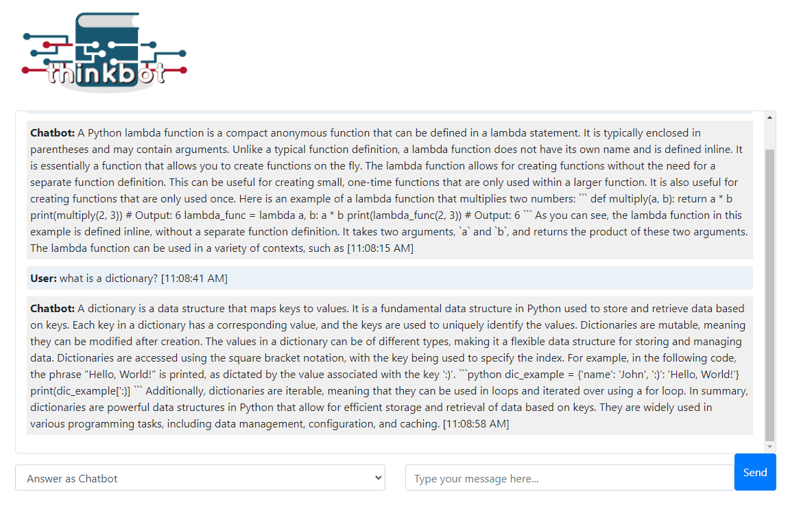
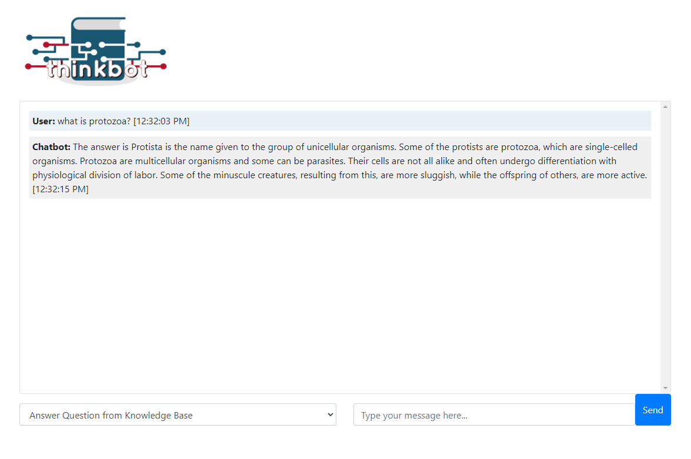
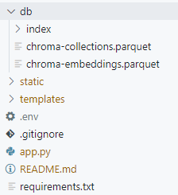
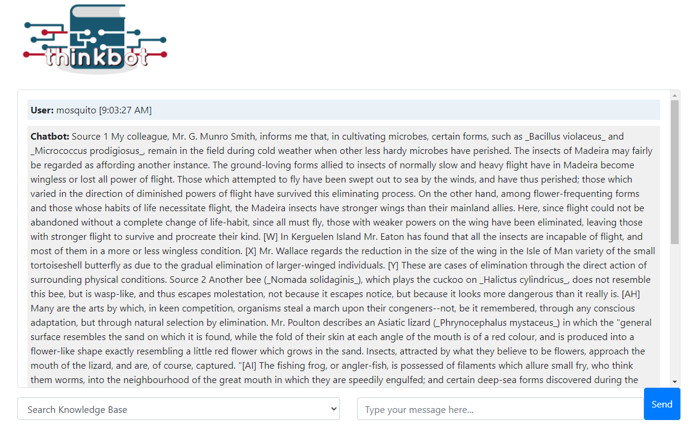
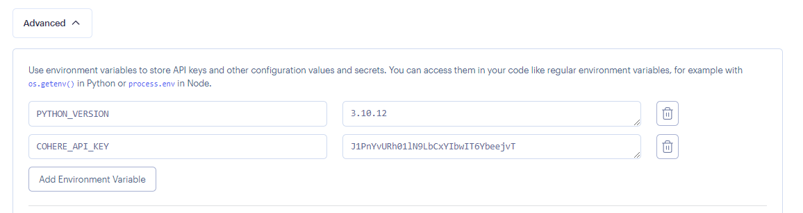

# Final Capstone: Expert Chatbot

> You have been chosen to join the development team of *ThinkBot*, an expert chatbot project that aims to answer topic-specific questions. As a developer at *ThinkBot*, your role will be to develop and implement the chatbot platform. This platform will allow users to receive answers to their questions through a user-friendly interface and a set of tools for customizing the chatbot's behavior and knowledge base.
> 
> Your goal is to ensure that the ThinkBot platform is intuitive, functional, and conducive to learning. This will involve developing the necessary tools, designing the user interface, and implementing features such as natural language processing and intelligent responses using LangChain chat prompt templates, generative question answering features, and other applicable techniques.

## Existing Files

The most relevant files in the project are the following:

| File name     | Description                                                                                  |
|---------------|----------------------------------------------------------------------------------------------|
| app.py        | The main application file. It contains the code for the application.                         |
| templates/index.html     | The template file for the application. It defines the structure and layout of the web form.  |
| static/style.css      | The CSS stylesheet for the application. It defines the visual style of the web form.         |
| tests/test.py       | The pytest unit test file. It contains test cases to ensure the functionality of the code.   |
| static/main.js   | The JavaScript file for the application. It contains client-side code and functionality to enhance user experience and interactivity on the web form. |

You will mostly work with the `app.py` and `index.html` files.

## Installation

1. Fork this repository.
2. Create a Codespace for your project.
3. GitHub Codespaces will automatically create a fully-configured development environment for your project in the cloud. If you need to install the requirements manually run: `pip install -r requirements.txt`.
4. To run the app, use the following command: `python app.py`
5. To run the tests simply use the following command: `pytest tests/*.py`

> **Tip:** Review the [Github Codespaces documentation](https://docs.github.com/en/codespaces/getting-started/quickstart) if you are unsure on how to run and test your app from Codespaces.

> **Note:** While it is not mandatory to pass all the unit tests to complete this assignment, it is highly recommended that you use the tests as a guide to deliver a functional application and meet the requirements of the rubric. Feel free to add or update the tests as you work through your project to ensure proper functionality.

## Product Backlog

>The user stories for your project have already been created. Each of the user stories is listed below, the user stories are to be implemented in the order in which they are listed. Another developer has already written the tests for the application so that you don't have to.

Find the *TODO* comments in the code and create the necessary functionality.

## US-01 Implement the *Answer as chatbot* feature

Your app should be able to respond to general user questions. Use LangChain chat prompt templates to implement this feature. You may also want to consider implementing a memory system for the chatbot to retain information from the conversation. This can enhance the user experience. Use the Cohere API to create a chain and generate relevant responses based on the user's input.



#### 1. Add the Cohere API key to `.env`

Set the `COHERE_API_KEY` environment variable so that your app can make calls to Cohere's language model. Create an `.env` file and create the environment variable. E.g. `COHERE_API_KEY=insert_your_api_key_here`

>Note: Remember that Cohere offers a free API usuage for their LLM. At times you may get a *"You are using a Trial key, which is limited to 5 API calls / minute. You can continue to use the Trial key for free or upgrade to a Production key with higher rate limits..."* message. This means that your chatbot may be slow to respond at times.

#### 2. Complete the `answer_as_chatbot()` function

Implement the `answer_as_chatbot()` function in `app.py` using LangChain. Your app should be able to respond to general user questions. Create and use a chat prompt template to implement this feature. Consider adding a memory system for the chatbot to retain information from the conversation.

#### Aceptance Criteria

1. The chatbot provides a response to the user's inquiry.
2. A prompt template is utilized to facilitate the interaction with the Language Model (LLM).

## US-02 Implement the *Answer question from knowledgebase* feature

Recall that you have already created a question answering system that can provide answers based on a given knowledgebase. The system has the capability to answer questions using a set of documents that you selected.

Your chatbot will include this feature as an option to allow users to ask topic-specific questions based on a set of documents of your choice.



#### 1. Create a Chroma database

Use the [notebook](https://colab.research.google.com/drive/1fGCia6TEjerDlysPqUFsBb8x3LwiG0Ef?usp=sharing) provided in the Generative Question Answering lesson to create a Chroma database and download it to your computer. Make sure that you choose a text that is related to your industry or that it's a text that may bring useful information.

>**Note:** Cohere has introduced a token limit for embeddings, so to prevent errors, it's recommended to use shorter texts, like a Wikipedia article. If you encounter any issues while creating your database using the notebook above, you are welcome to use [this](https://github.com/Thinkful-Ed/ai-in-web-dev-resources/raw/refs/heads/main/db.zip) pre-built database for your project.

>**Note:** Please be aware that Github imposes a [file size limit of 25MB](https://docs.github.com/en/repositories/working-with-files/managing-large-files/about-large-files-on-github#file-size-limits). Thus, if you add numerous documents to your database, it may exceed this limit. In case you have a file larger than 25MB, you have two options: 
>
>1. You can commit the file locally, thereby raising the limit to 50MB.
>2. Alternatively, you can reduce the size of your database files by removing some documents from your knowledge base.
>
>For this project, we recommend that you limit your files to no more than 25MB. Before proceeding to the next step, please ensure that your `chroma-embeddings.parquet` file is smaller than 25MB. If you are committing locally, you can have a file size limit of up to 50MB.

#### 2. Add the database to your project

To use the database in your app, you will need to add it in your project. Add the `db` folder to your project like shown in the screenshot below.



#### 3. Load the database in your flask app

Import RetrievalQA, Chroma, and CohereEmbeddings into your project.

```python
from langchain.chains import RetrievalQA
from langchain.embeddings import CohereEmbeddings
from langchain.vectorstores import Chroma
```

Create a function to load the database. To avoid any errors, make sure that you added the database to your project and that you have set your `COHERE_API_KEY` in your `.env` file. 

```python
def load_db():
    try:
        embeddings = CohereEmbeddings(cohere_api_key=os.environ["COHERE_API_KEY"])
        vectordb = Chroma(persist_directory='db', embedding_function=embeddings)
        qa = RetrievalQA.from_chain_type(
            llm=Cohere(),
            chain_type="refine",
            retriever=vectordb.as_retriever(),
            return_source_documents=True
        )
        return qa
    except Exception as e:
        print("Error:", e)

qa = load_db()
```

#### 4. Implement the *answer_from_knowledgebase* function

The function should call the RetrievalQA object that you created in the previous step when loading the database.

```python
def answer_from_knowledgebase(message):
    res = qa({"query": message})
    return res['result']
```

Make sure to test that your function works before proceeding to the next step.

#### Aceptance Criteria

1. The chatbot answers questions from the knowledgebase.
2. A user can select the "answer from knowledgebase" option from a dropdown menu.

## US-03 Implement the *search knowledgebase* feature

Your chatbot must also include a feature that allows a user to search your document knowledgebase. Recall that the source documents are already returned when using RetrievalQA and can be retrieved by calling `results["source_documents"]`.



#### 1. Implement the *search_knowledgebase* function

You can convert the sources into a string in the following manner:

```python
res = qa({"query": message})
sources = ""
for count, source in enumerate(res['source_documents'],1):
    sources += "Source " + str(count) + "\n"
    sources += source.page_content + "\n"
```

#### Aceptance Criteria

1. The chatbot answers questions from the knowledgebase.
2. A user can select the "answer from knowledgebase" option from a dropdown menu.

## US-04 Improve the user interface

In this step, you will focus on improving the user interface (UI) of your app. A visually appealing and user-friendly interface enhances the overall user experience.

#### 1. Come up with a name for your chatbot

Think of a unique and catchy name for your chatbot. The name should align with the purpose and theme of your chatbot.

#### 2. Enhance the design of the web form

Open the `index.html` file located in the templates folder. Use HTML and CSS to enhance the design of the web form. You can update the layout, color scheme, fonts, and other visual elements to make your app and chatbot more visually appealing.

Consider the following points when improving the design:

- Use meaningful headings and labels to guide users through the chatbot interaction.
- Create a user-friendly and intuitive interface by organizing the elements logically.
- Ensure proper alignment and spacing to improve readability and visual appeal.
- Incorporate suitable colors and fonts that align with the theme and purpose of the chatbot.

#### 3. Implement user-friendly features
To improve usability, you can implement additional user-friendly features. Here are some suggestions:

- Auto-scrolling: Implement auto-scrolling to ensure that the chat window automatically scrolls down to display the latest chat messages.
- Clear button: Add a button that allows users to clear the chat history and start afresh.
- Button styling: Enhance the styling of buttons to make them visually appealing and easy to identify.
- Error handling: Implement error handling to gracefully handle any errors or unexpected inputs from users.
- Loading indicators: Add loading indicators or animations to indicate when the chatbot is processing a user's query or performing a task.

#### Acceptance Criteria

1. The chatbot has an improved and visually appealing design.
2. The web form has a user-friendly and intuitive layout.
3. Additional user-friendly features, such as auto-scrolling and clear button, are implemented.
4. The overall UI enhances the user experience of interacting with the chatbot.

Update the `index.html`, `style.css`, and `main.js` files as needed to implement the improvements to the user interface. Test the chatbot in the browser to verify the changes and ensure a seamless user experience.

### US-05 Deployment

Congrats on getting this far! You finished the first version of your app. Now, it's time to deploy that app so that it can be tested by your clients. 

#### 1. Deploy your app on Render

Deploy the app on Render so that it becomes part of your portfolio. Use the following settings in Render to build and start the app:

1. Build command: `pip install -r requirements.txt`

2. Start command: `gunicorn app:app`

#### 2. Set the `PYTHON_VERSION` and `COHERE_API_KEY` environment variables

Render uses an older version of Python as default but this can be easily changed by setting an environment variable. Inside the Environment tab, create a new environment variable called `PYTHON_VERSION` and set its value to `3.10.12`. This will ensure that Render uses Python version 3.10.12 (the same version that you used in your notebook) for your app. Refer to the screenshot below for a visual guide.



> **Note:** Render automatically spins down a [free web service](https://render.com/docs/free#:~:text=Render%20spins%20down%20a%20Free,is%20back%20up%20and%20running.) if it remains inactive for 15 minutes without any incoming traffic. When a request is received, Render promptly spins up the service. However, the spinning up process may take a few seconds or, in some cases, up to a couple of minutes. During this time, there might be a noticeable delay for incoming requests, resulting in brief moments of hanging or slower page loads in a browser.

#### Aceptance Criteria

1. The project is deployed on Render.

## Success criteria

Functionality:

- For the answer as chatbot feature, a prompt template is utilized to facilitate the interaction with the Language Model (LLM).
- The chatbot can answer questions from the knowledgebase.
- A user can select the "answer as chatbot", "search knowledgebase", and "answer from knowledgebase" options from a dropdown menu.
- The app uses a RetrievalQA and a Chroma database for the search knowledgebase and answer from knowledegebase features.
- The app has an improved and visually appealing design.
- The web form has a user-friendly and intuitive layout.
- The overall UI enhances the user experience of interacting with the chatbot.
- The app is deployed on Render.

General code organization:

- Minimal code duplication
- Comments are used to describe the functions.

## Tips

- Follow the order of the user stories.
- If you are stuck, take a careful look at the provided resources. If you are still stuck, ask a friend, AI assistant, or a mentor for help.
- Read the user stories and tests carefully.
